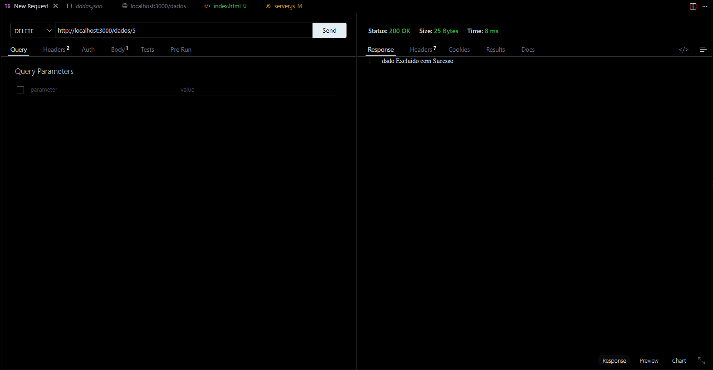

<div align="center">

# Prova de PBE 
### [Aula de Referência](https://github.com/wellifabio/senai2026/tree/main/ds/turmas/1DES_B/2%C2%BA%20Semestre/03-pbe1/aula07)
</div>

## Tecnologias Utilizadas 


## Passos para testar
- 1 Clone este repositório
- 2 Abra com [**VSCode**](https://code.visualstudio.com/download?_exp_download=fb315fc982) e em um terminal digite:
```bash
npm install
npm run dev
```
- 3 Teste as rotas com a extensão [Thunder Client](https://www.thunderclient.com/) do **VSCode**
- 4 Abra o arquivo client/index.html com a extensão `Live Server` do **VsCode**

---

## Print dos testes e exemplo de requisições

<details>
  <summary>Novo Dado</summary>
  <div align="center">
    
    
  </div>
</details>

<details>
  <summary>Coleta de Dados Geral</summary>
  <div align="center">
    
  </div>
</details>

<details>
  <summary>Busca por ID</summary>
  <div align="center">
    
  </div>
</details>

<details>
  <summary>Buscar por Local</summary>
  <div align="center">
    
  </div>
</details>

<details>
  <summary>Buscar por Nome</summary>
  <div align="center">
    
  </div>
</details>

<details>
  <summary>Editar Dado</summary>
  <div align="center">
    
    
  </div>
</details>

<details>
  <summary>Deletar Item</summary>
  <div align="center">
    
    
  </div>
</details>


---

### Cliente

<details>
  <summary>Index</summary>
  <div align="center">
    
    
    
  </div>
</details>
